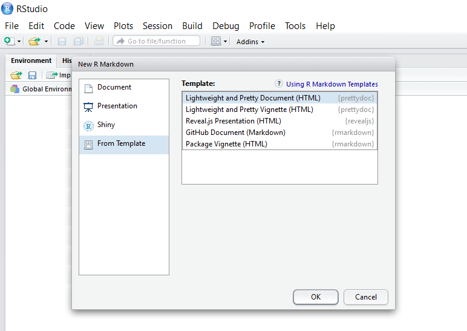

> Have you ever tried to find a lightweight yet nice theme for the R Markdown
documents, like [this page](cayman.html)?

## Themes for R Markdown

With the powerful [rmarkdown](http://rmarkdown.rstudio.com/index.html)
package, we could easily create nice HTML document
by adding some meta information in the header, for example

```yaml
---
title: Nineteen Years Later
author: Harry Potter
date: July 31, 2016
output:
  rmarkdown::html_document:
    theme: lumen
---
```

The [html_document](http://rmarkdown.rstudio.com/html_document_format.html)
engine uses the [Bootswatch](http://bootswatch.com/)
theme library to support different styles of the document.
This is a quick and easy way to tune the appearance of your document, yet with
the price of a large file size (> 700KB) since the whole
[Bootstrap](http://getbootstrap.com/) library needs to be packed in.

For package vignettes, we can use the
[html_vignette](http://rmarkdown.rstudio.com/package_vignette_format.html)
engine to generate a more lightweight HTML file that is meant to minimize the
package size, but the output HTML is less stylish than the `html_document` ones.

So can we do **BOTH**, a lightweight yet nice-looking theme for R Markdown?

## The prettydoc Engine

The answer is YES! (At least towards that direction)

The **prettydoc** package provides an alternative engine, `html_pretty`,
to knit your R Markdown document into pretty HTML pages.
Its usage is extremely easy: simply replace the
`rmarkdown::html_document` or `rmarkdown::html_vignette` output engine by
`prettydoc::html_pretty` in your R Markdown header, and use one of the built-in
themes and syntax highlighters. For example

```yaml
---
title: Nineteen Years Later
author: Harry Potter
date: July 31, 2016
output:
  prettydoc::html_pretty:
    theme: cayman
    highlight: github
---
```

You can also create documents from **prettydoc** templates in RStudio.

**Step 1:** Click the "New File" button and choose "R Markdown".

<div class="gallery">
  
</div>

**Step 2:** In the "From Template" tab, choose one of the built-in templates.

<div class="gallery">
  
</div>

## Options and Themes

The options for the `html_pretty` engine are fully compatible with the default
`html_document`
(see the [documentation](http://rmarkdown.rstudio.com/html_document_format.html))
with two exceptions:

1. The `theme` option can take value from `cayman`, `tactile` and
`architect`. More themes will be added in the future. The themes contained in
**prettydoc** are much inspired by and modified from
various [Github page themes](https://github.com/blog/1081-instantly-beautiful-project-pages).
2. The `highlight` options takes value from `github` and `vignette`.

See the [Themes](themes.html) page for an overview of the available themes in
**prettydoc**.
