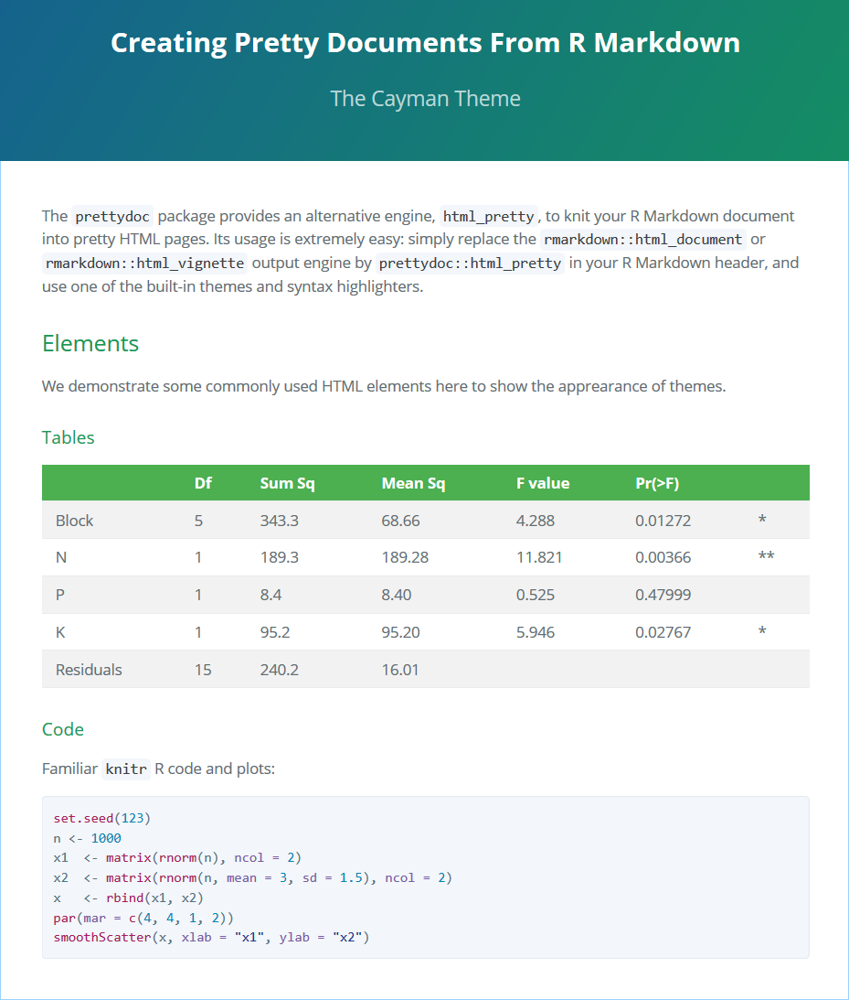
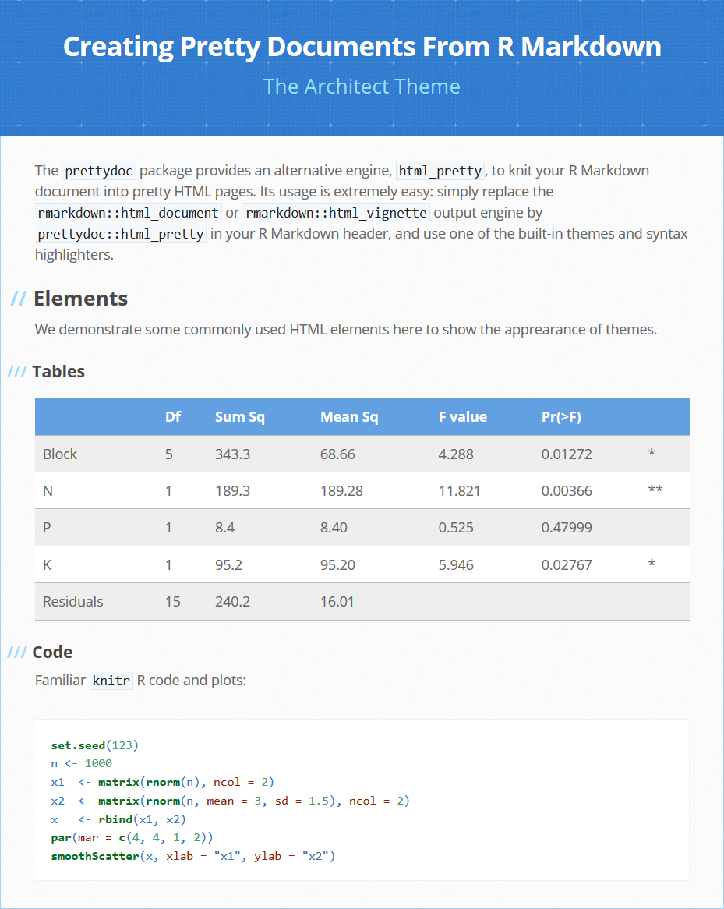

## Themes

Here are some screenshots of the HTML pages generated by **prettydoc** with
different themes.

  <h3>Cayman <a href="cayman.html">(Demo Page)</a></h3>
  

  <h3>Tactile <a href="tactile.html">(Demo Page)</a></h3>
  

  <h3>Architect <a href="architect.html">(Demo Page)</a></h3>
  

